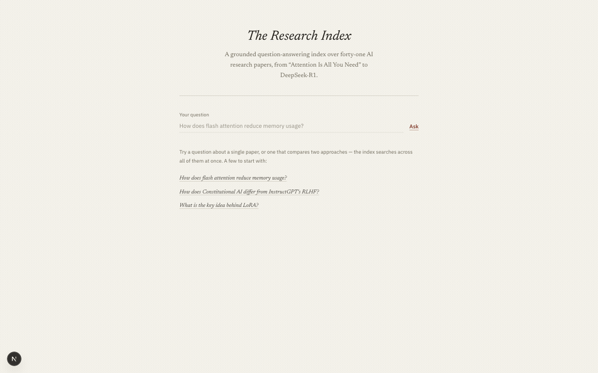

# AI Research Paper Assistant

**Live demo:** https://ai-research-paper-rag.vercel.app

A retrieval-augmented generation (RAG) system that answers questions about AI/ML research papers, with citations back to the source paper and page. Built to demonstrate a production RAG pipeline end to end, not just a notebook demo.

> The public demo runs on `z-ai/glm-5.2:free`, a free OpenRouter model, to keep the deployment from touching anyone's OpenAI billing. Free-tier OpenRouter rate limits apply (20 requests/minute, 50/day), so it can go quiet under load and answers won't match the quality of local dev, which runs `gpt-4o-mini` directly against OpenAI.



## What it does

Ask a question like "how does Constitutional AI differ from InstructGPT's RLHF approach?" and get an answer grounded in a local corpus of 41 papers (Transformer through 2026 releases), with the specific paper and page cited for every claim. If the corpus doesn't contain the answer, the system says so instead of guessing — a self-correcting LangGraph loop grades each retrieval and rewrites the query before falling back to a refusal.

## Stack

| Layer | Choice |
|---|---|
| Ingestion | PyPDFLoader |
| Chunking | RecursiveCharacterTextSplitter |
| Embeddings | OpenAI `text-embedding-3-small` |
| Vector store | Chroma (local) |
| Orchestration | LangGraph (retrieve → grade → generate, with a query-rewrite retry loop) |
| Generation | `gpt-4o-mini` locally via OpenAI; free `z-ai/glm-5.2:free` via OpenRouter in production (structured output via Pydantic — grounded answer + cited chunk IDs) |
| Serving | FastAPI |
| UI | Next.js (App Router) + Tailwind |
| Evaluation | RAGAS (faithfulness, context precision/recall) — in progress |
| Deployment | Single Vercel project (Vercel Services: Next.js + Python/FastAPI), Chroma index hydrated from Vercel Blob on cold start |

## Project structure

```
RAG_PROJECTS/
├── data/raw/papers/       # source PDFs (gitignored, see below)
├── src/rag/
│   ├── ingestion.py       # PDFs -> Document objects
│   ├── chunking.py        # Document objects -> chunks
│   ├── embeddings.py      # chunk text -> vectors
│   ├── vectorstore.py     # Chroma index (build + load)
│   ├── retrieval.py       # query -> top-k chunks
│   ├── generation.py      # chunks + query -> grounded, cited answer
│   └── pipeline.py        # LangGraph graph: retrieve -> grade -> generate (+ retry)
├── api/main.py             # FastAPI serving layer
├── frontend/               # Next.js UI (App Router)
├── eval/                   # hand-written Q&A set + RAGAS runner (in progress)
└── docs/ARCHITECTURE.md    # how the pieces fit together
```

## Setup

Backend:
```bash
python3 -m venv venv
source venv/bin/activate
pip install -r requirements.txt
```

Add your API key to `.env`:
```
OPENAI_API_KEY=...
```

Data isn't committed to this repo (see `.gitignore`) — point `data/raw/papers/` at your own PDFs, then build the index once:
```bash
python3 -c "from src.rag.ingestion import load_documents; from src.rag.chunking import chunk_documents; from src.rag.vectorstore import build_vectorstore; build_vectorstore(chunk_documents(load_documents()))"
```

Run the API:
```bash
uvicorn api.main:app --port 8000
```

Frontend:
```bash
cd frontend
npm install
npm run dev
```
Open `http://localhost:3000`.

## Deployment

One Vercel project (`ai-research-paper-rag`) serves both the Next.js frontend and the FastAPI backend via [Vercel Services](https://vercel.com/docs/services): `vercel.json` routes `/health` and `/query` to the Python function and everything else to Next.js, so both live on the same origin with no CORS hop in production.

The built Chroma index (gitignored, too large for git) is uploaded once to Vercel Blob; on cold start, `src/rag/vectorstore.py` downloads and extracts it into `/tmp` when the `VERCEL` env var is present, then loads it from there. Local dev is unaffected — it still reads `chroma_db/` directly.

Required production environment variables:
- `OPENAI_API_KEY` — used for embeddings (`text-embedding-3-small`) even in production; cheap enough per query to leave on direct OpenAI billing.
- `OPENROUTER_API_KEY` — required for chat/generation in production. If it's missing, the app deliberately fails at startup rather than silently falling back to `gpt-4o-mini` on Sahil's OpenAI key.
- `CHROMA_BLOB_URL` — public Vercel Blob URL for the packaged index.

## Status

Core pipeline complete and working end to end: ingestion → chunking → embeddings → vectorstore → retrieval → LangGraph self-correction loop → generation, served over FastAPI with a Next.js UI. Evals (`eval/`) are the current focus — a hand-written 30-50 question set scored with RAGAS, to compare retrieval/chunking strategies with real numbers instead of eyeballing answers.
