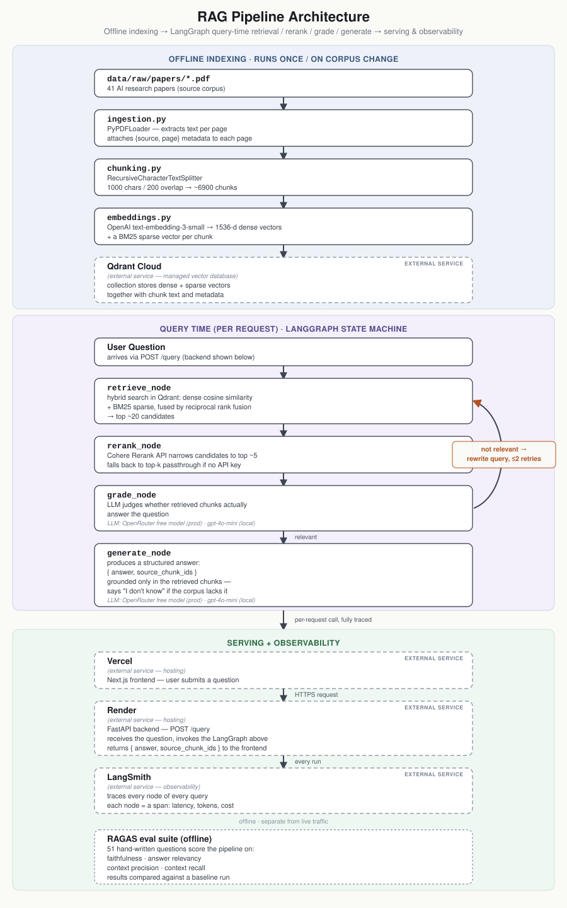
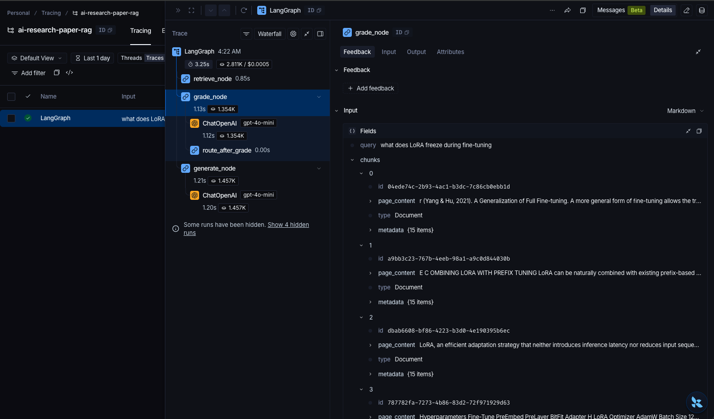

# The Research Index

**Live demo:** https://ai-research-paper-rag.vercel.app

A retrieval-augmented generation system that answers questions about AI/ML research papers and cites the source paper and page behind every claim. It is built to show a production RAG pipeline end to end: hybrid dense and sparse retrieval, a cross-encoder reranker, a self-correcting LangGraph loop, scored evaluation, cost-safe deployment, and tracing. Not a notebook demo.

> The public demo runs on free OpenRouter models, so the deployment never touches anyone's OpenAI billing. It tries `minimax/minimax-m3:free` first and falls back across three more free models when one is saturated, because the shared free pool returns 429 often enough that a single model is not a demo. Free-tier account limits still apply (20 requests/minute, 50/day), and answers will not match local dev, which runs `gpt-4o-mini` directly against OpenAI.


<sub>Full-quality screen recording: [`docs/demo.mp4`](docs/demo.mp4)</sub>

## Architecture



Three layers, each with its own constraints. The **indexing layer** runs offline, once per corpus change: PDFs become per-page documents, documents become overlapping chunks, and each chunk is written to Qdrant Cloud with both a dense embedding and a BM25 sparse vector. The **query layer** runs online, per question, as a LangGraph state machine that retrieves, reranks, grades its own retrieval, and either generates or retries. The **serving layer** is split across two hosts: a Next.js frontend on Vercel and a FastAPI backend on Render, genuinely cross-origin and CORS-configured.

The only thing indexing and querying share is the shape of what indexing wrote, which is why an indexing mistake is so expensive: it is invisible at query time and just looks like bad retrieval.

## What it does

Ask something like "how does Constitutional AI differ from InstructGPT's RLHF approach?" and get an answer grounded in a corpus of 41 papers, from Attention Is All You Need through DeepSeek-R1, with the specific paper and page cited for every claim. If the corpus does not contain the answer, the system says so instead of guessing.

## How a question flows through

1. **`retrieve_node`** runs dense vector search and BM25 sparse search over the same Qdrant collection, then merges the two result lists with reciprocal rank fusion into roughly 20 candidates. Fusing on rank rather than raw score matters, because cosine similarity and BM25 scores are not on a comparable scale. Dense search handles paraphrase; sparse search handles the rare literal token (a model name, an acronym, a number) that an embedding averages away.
2. **`rerank_node`** sends those candidates to the Cohere Rerank API, a cross-encoder that reads the query and each chunk together and scores the pair, and keeps the top 5. Without a `COHERE_API_KEY` the node passes its input through unchanged, so the pipeline still runs on a fresh clone.
3. **`grade_node`** asks an LLM one narrow question about the reranked context: does it actually contain the answer. The prompt is deliberately strict, because being topically related is not enough.
4. If the grade fails, the query is rewritten and control loops back to retrieval, capped at 2 retries. Unbounded self-correction is an unbounded bill.
5. **`generate_node`** returns structured output (a grounded answer plus the chunk IDs it drew from) so citations are a lookup rather than a hope, and refuses with "I don't know" when the context does not support an answer. Structured output is asked for as JSON and parsed with a fallback rather than through `with_structured_output`, because the free open-weight model in production answers in prose often enough that a strict parser turns a good answer into a 500.

## Stack

| Layer | Choice |
|---|---|
| Ingestion | PyPDFLoader (text per page, `{source, page}` metadata) |
| Chunking | RecursiveCharacterTextSplitter, 1000 chars with 200 overlap, ~6900 chunks |
| Embeddings | OpenAI `text-embedding-3-small` (dense) + BM25 (sparse) |
| Vector store | Qdrant Cloud (free tier), storing both vectors per chunk |
| Retrieval | Hybrid dense + sparse with reciprocal rank fusion, ~20 candidates |
| Reranking | Cohere Rerank to top 5, graceful passthrough without a key |
| Orchestration | LangGraph: retrieve → rerank → grade → generate, with a query-rewrite retry loop |
| Generation | `gpt-4o-mini` locally via OpenAI; a fallback chain of free OpenRouter models in production (`minimax/minimax-m3:free` first); structured output via Pydantic |
| Serving | FastAPI |
| UI | Next.js (App Router) + Tailwind, manuscript-style design |
| Evaluation | RAGAS against a hand-written 51-question set |
| Observability | LangSmith tracing, automatic across every LangGraph node |
| Deployment | Next.js on Vercel, FastAPI on Render |

## Evaluation

`eval/dataset.jsonl` is 51 hand-written questions across three categories:

- Single-document factual questions, which check the basic path.
- Cross-document comparisons, which force retrieval to pull good chunks from two different papers in one query. This is where a naive top-k quietly returns five chunks from the same paper.
- Adversarial and out-of-scope questions, which have no answer in the corpus and must produce a refusal. A system that never refuses will eventually invent something.

`eval/run_eval.py` runs every question through the real pipeline, not a mock, and scores the actual retrieved context and generated answer with RAGAS. Splitting retrieval and generation into separate metrics is what makes the numbers actionable: a system can be perfectly faithful to bad context, which reads as a generation problem while being entirely a retrieval one.

Baseline, measured before hybrid search and reranking landed:

| Metric | Score |
|---|---|
| Faithfulness | 0.75 |
| Answer relevancy | 0.75 |
| Context precision | 0.80 |
| Context recall | 0.77 |

Full per-question results are saved under `eval/runs/`, so a later change to chunking, retrieval or a prompt gets diffed against a number instead of a handful of example answers that happened to look fine.

## Observability

Every `rag_graph.invoke()` call traces automatically through LangSmith. No manual instrumentation is needed, since the whole pipeline is built on LangChain and LangGraph primitives. Each node shows up as its own span with latency, token counts and cost:



Evaluation and tracing answer different questions. An eval score tells you the system got worse. A trace tells you which node did it, what retrieval returned, how the grader ruled, and what the rewritten query looked like on the second attempt.

## What went wrong

### The deployment that would not fit

The first deploy was a single Vercel project running the Next.js frontend and the FastAPI backend as two Vercel Services, with a local Chroma index hydrated from Vercel Blob on cold start. The Python function bundle came out at 724MB against a 500MB limit, and trimming unused dependencies only got it to 699MB. The rest was chromadb's own hard dependencies (onnxruntime, grpcio, kubernetes), all for a distributed server mode that embedded mode never uses. Stubbing them with fake empty packages made the resolver silently downgrade `langchain-chroma` to a years-old version to satisfy the fake version numbers, which is not a risk worth taking on a live app, so that was reverted. Switching to Qdrant Cloud moved the vector engine out of the process and dropped the bundle to about 114MB locally, but Vercel's real ceiling for that project turned out to be 225MB post-optimization, and `qdrant-client` carries its own hard `grpcio` dependency in its main import path with nothing safe left to strip. Moving just the backend to Render, which has no equivalent packaging ceiling, was simpler than fighting the dependency tree further. Serverless size limits punish batteries-included libraries, and the dependency you did not choose is the one that decides whether you can deploy.

### The bug hiding behind a CORS error

The deployed app failed in the browser with a missing `Access-Control-Allow-Origin` header. The actual cause was a 429 from the free model's congested upstream pool, which raised an unhandled exception in the FastAPI handler. An unhandled exception never travels back out through the middleware stack, so no CORS headers got attached and the browser reported the only thing it could see. The fix was to catch known failures and return a real JSON response (503 with a plain message) so the headers attach and the user reads the true cause. The error you see in the browser is usually the last thing that went wrong, not the first.

### Evaluation caught a retry loop that was not working

The self-correction loop was tested with an off-corpus question ("what is the capital of France") and correctly answered "I don't know". The trace told a different story: retries at 1 and the query unchanged, meaning the grader had marked garbage retrieval as relevant and the refusal came from the generation prompt's own guardrail, not the retry loop. The test passed on the wrong safeguard. Tightening the grading prompt so that topical relation is not enough, and the context must literally contain the answer, made retries reach the cap and the query actually get rewritten. A passing test tells you something passed, not what.

### Free tiers are not free of failure

The free OpenRouter model hit congestion at the upstream provider's shared pool repeatedly, across two different models and two different providers on the same day. Mitigations are OpenAI-SDK retries with backoff and OpenRouter provider-fallback routing, so a request can try another provider serving the same model. Neither is a guarantee. No free model is promised to be available, and this README would rather say so than pretend otherwise.

## Project structure

```
RAG_PROJECTS/
├── data/raw/papers/       # source PDFs (gitignored, see below)
├── src/rag/
│   ├── ingestion.py       # PDFs -> Document objects (per page, with source/page)
│   ├── chunking.py        # Document objects -> overlapping chunks
│   ├── embeddings.py      # chunk text -> dense vectors
│   ├── vectorstore.py     # Qdrant Cloud index, dense + sparse (build + load)
│   ├── retrieval.py       # query -> hybrid dense/sparse candidates, fused by RRF
│   ├── reranker.py        # candidates -> top 5 via Cohere Rerank (optional)
│   ├── generation.py      # chunks + query -> grounded, cited answer
│   ├── llm.py             # shared chat model: OpenAI locally, OpenRouter in production
│   └── pipeline.py        # LangGraph: retrieve -> rerank -> grade -> generate (+ retry)
├── api/main.py            # FastAPI serving layer
├── frontend/              # Next.js UI (App Router)
├── eval/
│   ├── dataset.jsonl      # 51 hand-written Q&A pairs
│   ├── run_eval.py        # RAGAS runner
│   └── runs/              # timestamped per-run results
├── vercel.json            # Vercel config for the frontend service
└── docs/ARCHITECTURE.md   # how the pieces fit together
```

## Setup

Backend:

```bash
python3 -m venv venv
source venv/bin/activate
pip install -r requirements.txt
```

Add your API keys to `.env`:

```
OPENAI_API_KEY=...
QDRANT_URL=...
QDRANT_API_KEY=...
```

`QDRANT_URL` and `QDRANT_API_KEY` come from a free cluster at [cloud.qdrant.io](https://cloud.qdrant.io), no card required.

Optional, for reranking. Without it the rerank node passes candidates through untouched:

```
COHERE_API_KEY=...
```

Optional, for LangSmith tracing. No code changes needed:

```
LANGSMITH_TRACING=true
LANGSMITH_API_KEY=...
LANGSMITH_PROJECT=ai-research-paper-rag
```

Data is not committed to this repo (see `.gitignore`). Point `data/raw/papers/` at your own PDFs, then build the index once. This wipes and recreates the Qdrant collection:

```bash
python3 -c "from src.rag.ingestion import load_documents; from src.rag.chunking import chunk_documents; from src.rag.vectorstore import build_vectorstore; build_vectorstore(chunk_documents(load_documents()))"
```

Run the API:

```bash
uvicorn api.main:app --port 8000
```

Run the evals. These deps are kept out of `requirements.txt` on purpose, since `ragas` and `datasets` are heavy and have no business in the deployed API image:

```bash
pip install -r requirements-eval.txt
python3 -m eval.run_eval
```

Frontend:

```bash
cd frontend
npm install
npm run dev
```

Open `http://localhost:3000`.

## Deployment

Frontend and backend live on two different hosts.

**Backend**, FastAPI on [Render](https://render.com) (`ai-research-paper-rag.onrender.com`), free web service, deployed straight from this repo with `pip install -r requirements.txt` and `uvicorn api.main:app --host 0.0.0.0 --port $PORT`. Environment variables:

- `OPENAI_API_KEY` for embeddings (`text-embedding-3-small`), used even in production because embedding one question costs a fraction of a cent.
- `OPENROUTER_API_KEY` for chat and generation in production. If it is missing on a deployed host, the app deliberately fails at startup rather than silently falling back to `gpt-4o-mini` on the maintainer's OpenAI key. Failing closed turns an invoice into an error message.
- `QDRANT_URL` and `QDRANT_API_KEY` for the Qdrant Cloud cluster holding the index.
- `COHERE_API_KEY`, optional, enables reranking.
- `LANGSMITH_TRACING`, `LANGSMITH_API_KEY`, `LANGSMITH_PROJECT`, optional, as in local dev.

**Frontend**, Next.js on Vercel (`ai-research-paper-rag.vercel.app`), deployed from `frontend/`. One environment variable:

- `NEXT_PUBLIC_API_URL`, the Render backend URL. The two hosts are genuinely cross-origin, and CORS in `api/main.py` allows the Vercel frontend's origin.

The vector index lives in Qdrant Cloud rather than in a file bundled with either deployment. The client is a thin API wrapper and the actual search runs on Qdrant's own server, which is what made the backend small enough to deploy at all.

## Status

Complete and working end to end: ingestion, chunking, dense and sparse embeddings, Qdrant Cloud index, hybrid retrieval with reciprocal rank fusion, Cohere reranking, the LangGraph self-correction loop, and grounded cited generation. Served over FastAPI on Render with a Next.js UI on Vercel, behind a cost-safe production model swap, evaluated with RAGAS against a 51-question hand-written set, and traced end to end with LangSmith.
